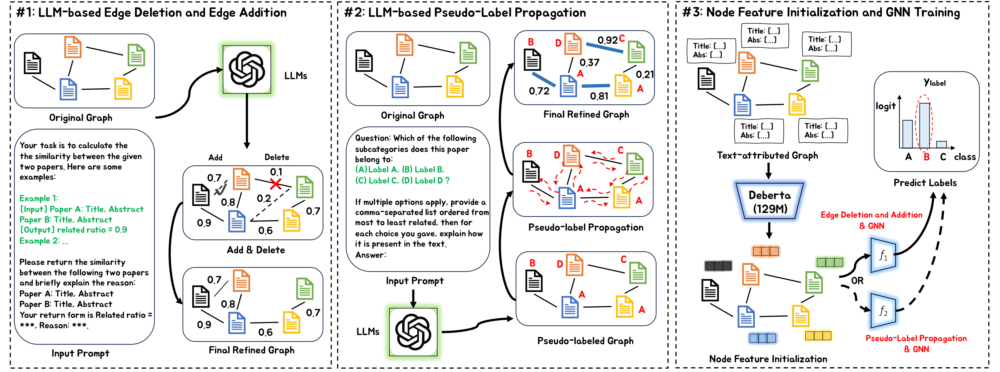

## Large Language Models as Topological Structure Enhancers for Text-Attributed Graphs (LLM4GraphTopology)


[](https://arxiv.org/abs/2311.14324)
[](https://dasfaa2025.github.io/)
[](https://pytorch.org/)
 

This is the Pytorch implementation for our *DASFAA'25* paper: [**LLM4GraphTopology: Large Language Models as Topological Structure Enhancers for Text-Attributed Graphs**](https://arxiv.org/abs/2311.14324). 

## Abstract
<div style="text-align: justify;">
The latest advancements in large language models (LLMs) have revolutionized the field of natural language processing (NLP). Inspired by the success of LLMs in NLP tasks, some recent work has begun investigating the potential of applying LLMs in graph learning tasks. However, most of the existing work focuses on utilizing LLMs as powerful node feature augmenters, leaving employing LLMs to enhance graph topological structures an understudied problem. In this work, we explore how to leverage the information retrieval and text generation capabilities of LLMs to refine/enhance the topological structure of text-attributed graphs (TAGs) under the node classification setting. First, we propose using LLMs to help remove unreliable edges and add reliable ones in the TAG. Specifically, we first let the LLM output the semantic similarity between node attributes through delicate prompt designs, and then perform edge deletion and edge addition based on the similarity. Second, we propose using pseudo-labels generated by the LLM to improve graph topology, that is, we introduce the pseudo-label propagation as a regularization to guide the graph neural network (GNN) in learning proper edge weights. Finally, we incorporate the two aforementioned LLM-based methods for graph topological refinement into the process of GNN training and perform extensive experiments on four real-world datasets. The overall framework is as follows:
<div> 
<br>




## Environment Requirement
    # More details about the environment and device can be seen in ./code/requirement.txt.
    python==3.8.17
    torch==1.12.1+cu113 
    torch-cluster==1.6.0+pt112cu113
    torch-scatter==2.0.9  
    torch-sparse==0.6.14  
    torch-spline-conv==1.2.1+pt112cu113
    torch-geometric==2.3.1

## Datasets & Checkpoints

We provide Datasets & Checkpoints in [link](https://portland-my.sharepoint.com/:f:/g/personal/shengysun4-c_my_cityu_edu_hk/Euf8rADG-fNEsvuD93qfkIYBDMMo9_gotLHVL_Ffju2Uyg?e=WIH4D4). Please download them to the path ./code/ before running the code.

## Run the Code
    cd code  
    bash run_general_setting.sh  
    bash run_fewshot_setting.sh  

## Acknowledgment of Open-Source Code Contributions  

  The code is based on the open-source repository: [TAPE](https://github.com/XiaoxinHe/TAPE), many thanks to the authors! 

You are welcome to cite our paper:
```
@inproceedings{SunRen25,
  title={Large Language Models as Topological Structure Enhancers for Text-Attributed Graphs},
  author={Sun, Shengyin and Ren, Yuxiang and Chen, Jiehao and Ma, Chen},
  booktitle={arXiv:2311.14324},
  year={2025}
}
